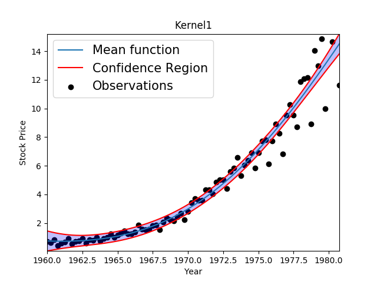
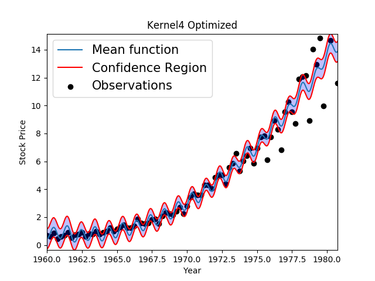
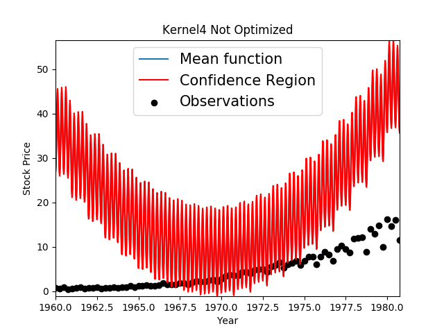
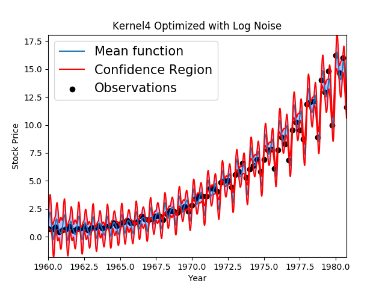

# Julia_Optimization_Projects

This is a repository for housing Julia Optimization projects I am working on, both in Convex Optimization and in Gaussian Processes. Currently, I am experimenting with a short script [here](convex_control_optimization.jl) and trying to use convex optimization to optimize a real world control system.

Additionally, I am experimenting and learning about the impacts of different kernels on Gaussian Processes, and I have tried some kernels against a [Johnson and Johnson Stock Price dataset](JohnsonJohnson.csv), code seen [here](gaussian_process_experiments.jl). Results of using kernels

```Julia
kernel1 = SE(1.0,1.0)
kernel2 = SE(2.0,2.0)
kernel3 = SE(3.0,3.0)
kernel4 = Periodic(0.0,1.0,0.0)*SE(4.0,0.0) # Locally periodic
kernel5 = SE(4.0,4.0) + Periodic(0.0,1.0,0.0)*SE(4.0,0.0) + RQ(0.0,0.0,-1.0) + SE(-2.0,-2.0)
```
to model the data are as follows:

Standard square exponential


I then proceeded to analyze the effect of using a locally periodic kernel (source: http://www.cs.toronto.edu/~duvenaud/cookbook/index.html), which produced more interesting results:

I optimize the hyperparameters:


Then I plot without optimizing hyperparameters (clear worse performance):


I then optimize and add a predicted log_noise to the system:


Which produces spikes due to the predicted noise.
